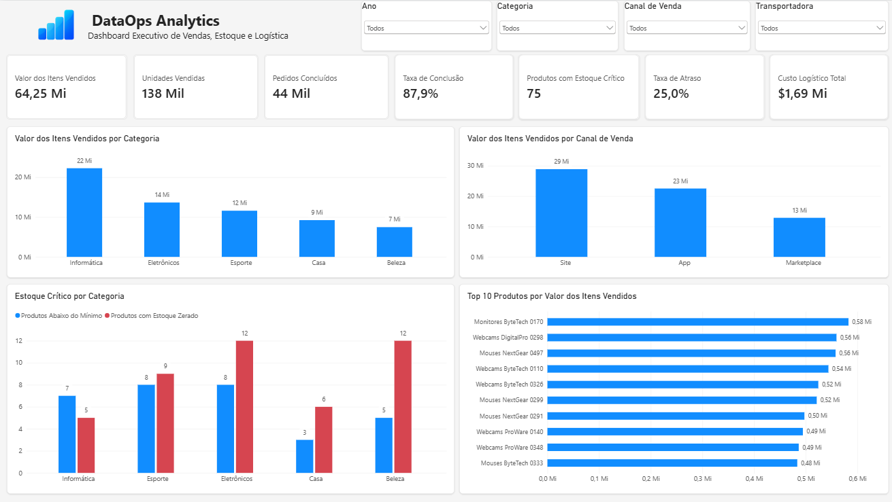
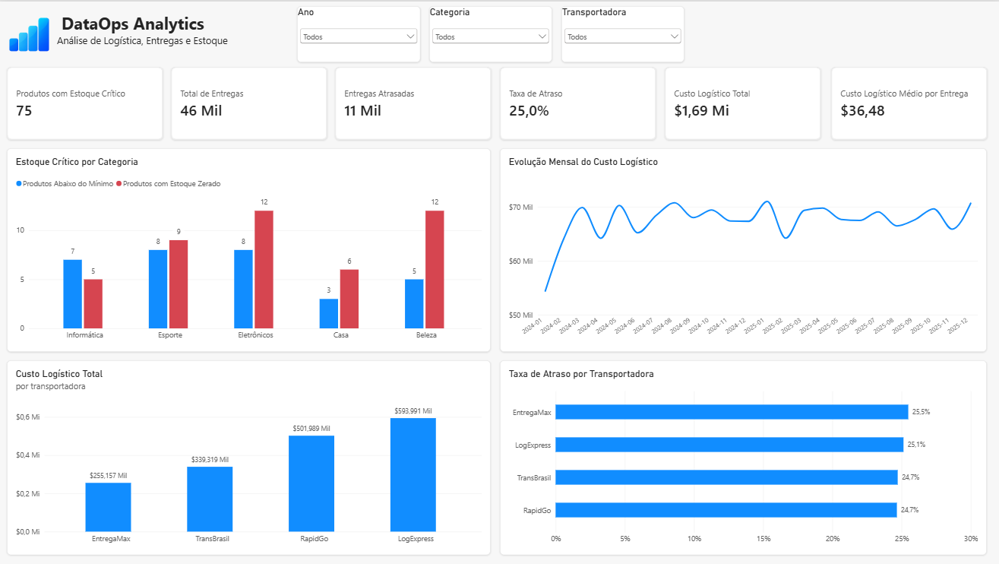
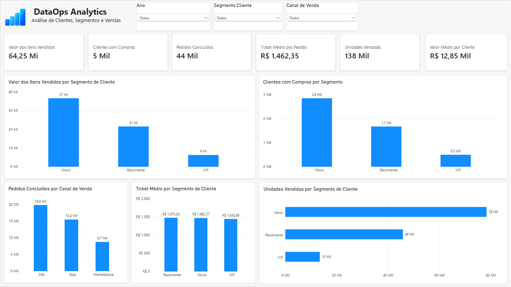

# DataOps Analytics

Projeto de portfólio desenvolvido para demonstrar competências práticas em **Análise de Dados, Business Intelligence, Engenharia de Dados e DataOps**, utilizando Python, SQL, PostgreSQL, Docker, Excel, Power BI, Databricks e Git/GitHub.

O projeto simula um ambiente de dados de uma operação de vendas, integrando informações de clientes, produtos, pedidos, pagamentos, estoque e entregas.

> **Importante:** todos os dados utilizados neste projeto são sintéticos e foram gerados exclusivamente para fins educacionais e de portfólio. Os resultados não representam uma empresa real e não devem ser interpretados como impacto financeiro real.

---

## 🎯 Objetivo do projeto

Construir um pipeline analítico reproduzível capaz de:

- gerar e organizar dados sintéticos;
- integrar arquivos CSV e Excel;
- enriquecer dados por API pública;
- aplicar validações de qualidade;
- carregar e reconciliar dados no PostgreSQL;
- executar PostgreSQL em container Docker;
- estruturar camadas RAW e Analytics;
- construir modelo dimensional;
- desenvolver análises utilizando SQL;
- aplicar CTEs, JOINs, subconsultas e funções de janela;
- desenvolver análises e dashboard em Excel;
- construir dashboard interativo no Power BI;
- implementar arquitetura Medallion no Databricks;
- estruturar camadas Bronze, Silver e Gold;
- reconciliar dados entre diferentes camadas e tecnologias;
- identificar indicadores relevantes para vendas, logística e estoque;
- documentar regras de negócio e decisões técnicas;
- aplicar conceitos de DataOps, versionamento, qualidade e reprodutibilidade.

---

# 🏗️ Arquitetura do projeto

```text
                DADOS SINTÉTICOS
              CSV / Excel / Python
                      │
                      ▼
              Python / Pandas
                      │
             ┌────────┴────────┐
             │                 │
             ▼                 ▼
       API BrasilAPI      PostgreSQL
       CEP / Clientes       Docker
             │                 │
             ▼                 ├── raw
     Dados enriquecidos        │
                               └── analytics
                                      │
                                      ▼
                              Modelo Dimensional
                                      │
                    ┌─────────────────┼─────────────────┐
                    │                 │                 │
                    ▼                 ▼                 ▼
                  Excel           Power BI         SQL Analítico
                    │                 │                 │
                    └─────────────────┴─────────────────┘
                                      │
                                      ▼
                                  Insights

Arquivos do projeto
        │
        ▼
    Databricks
        │
        ├── Bronze
        │
        ├── Silver
        │
        └── Gold
              │
              ▼
       Análises de Negócio
```

O projeto possui dois fluxos analíticos complementares:

1. **Ambiente local:** Python → PostgreSQL → Excel / Power BI / SQL.
2. **Databricks:** Bronze → Silver → Gold → análises.

Essa abordagem permite comparar resultados entre tecnologias e validar a consistência das métricas.

---

## 🐳 Ambiente PostgreSQL

O PostgreSQL 17 é executado em container Docker.

```text
Windows
   │
   └── localhost:5433
           │
           ▼
        Docker
           │
           ▼
   PostgreSQL :5432
```

As configurações são fornecidas por variáveis de ambiente e o banco utiliza volume Docker para persistência.

---

# 🛠️ Tecnologias utilizadas

## Dados e programação

- Python 3
- Pandas
- SQL
- SQLAlchemy
- Psycopg
- OpenPyXL
- Requests
- python-dotenv

## Banco e infraestrutura

- PostgreSQL 17
- Docker
- Docker Compose

## Business Intelligence

- Microsoft Excel
- Power BI Desktop
- DAX

## Engenharia de Dados

- Databricks
- Delta Tables
- arquitetura Medallion
- Bronze / Silver / Gold
- Databricks SQL
- Serverless Compute

## Versionamento

- Git
- GitHub

## Integrações

- BrasilAPI — consulta de CEP

## Próxima evolução

- Microsoft Azure
- integração de serviços cloud ao pipeline

---

# 📊 Dados do projeto

O cenário possui dados relacionados a:

- clientes;
- produtos;
- pedidos;
- itens de pedido;
- pagamentos;
- estoque;
- entregas.

## Volumes

| Fonte | Registros |
|---|---:|
| Clientes | 5.000 |
| Produtos | 500 |
| Pedidos | 50.000 |
| Itens de pedido | 109.982 |
| Pagamentos | 50.000 |
| Estoque | 12.000 |
| Entregas | 46.337 |

Período dos pedidos:

**01/01/2024 a 31/12/2025**

A dimensão calendário possui:

**731 datas**

---

# 🗄️ PostgreSQL

Foram criados dois schemas principais.

## `raw`

Armazena dados próximos às fontes.

```text
raw.clientes
raw.produtos
raw.pedidos
raw.itens_pedido
raw.pagamentos
raw.estoque
raw.entregas
```

## `analytics`

Camada preparada para consumo analítico.

```text
analytics.dim_cliente
analytics.dim_produto
analytics.dim_data
analytics.fato_vendas
analytics.fato_entregas
analytics.fato_estoque
```

Volumes reconciliados na camada Analytics:

| Tabela | Registros |
|---|---:|
| dim_cliente | 5.000 |
| dim_produto | 500 |
| dim_data | 731 |
| fato_vendas | 109.982 |
| fato_entregas | 46.337 |
| fato_estoque | 12.000 |

---

# ⭐ Modelo dimensional

## Dimensões

### `dim_cliente`

Informações cadastrais, localização e segmentação dos clientes.

### `dim_produto`

Produtos, categorias, subcategorias, marcas, custos e preços.

### `dim_data`

Calendário utilizado nas análises temporais.

## Fatos

### `fato_vendas`

Granularidade:

> um item por pedido.

### `fato_entregas`

Granularidade:

> uma entrega por pedido elegível para entrega.

### `fato_estoque`

Granularidade:

> um produto por snapshot mensal.

---

# 🔎 Qualidade de dados

O projeto aplica verificações para:

- chaves primárias duplicadas;
- valores nulos;
- integridade entre chaves estrangeiras;
- pedidos sem itens;
- pagamentos divergentes;
- entregas associadas a pedidos cancelados;
- inconsistências de status;
- estoque negativo;
- quantidade reservada maior que disponível;
- totais inválidos;
- CEPs inválidos;
- consistência de localização;
- reconciliação RAW × Analytics;
- reconciliação Silver × Gold;
- consistência de métricas entre PostgreSQL, Excel, Power BI e Databricks.

---

# 🧠 Regras de negócio identificadas durante o projeto

## Atraso de entrega

Durante a validação foi identificada uma diferença importante na definição da métrica de atraso.

Comparar diretamente timestamps:

```sql
data_entrega > data_prevista
```

gerava falsos atrasos quando uma entrega ocorria no mesmo dia da previsão, pois `data_prevista` estava armazenada à meia-noite.

A regra foi corrigida para comparar apenas as datas:

```sql
CAST(data_entrega AS DATE) > CAST(data_prevista AS DATE)
```

Resultado validado:

**11.187 entregas atrasadas**

A taxa geral entre entregas concluídas foi:

**24,96%**

---

## Tentativas de entrega

Uma validação inicial considerava qualquer:

```text
tentativas_entrega <= 0
```

como erro.

A investigação mostrou que:

- entregas concluídas possuem de 1 a 3 tentativas;
- entregas em trânsito podem possuir 0 tentativas.

Portanto, a regra foi refinada para considerar inválido somente:

```text
status = Entregue
e
tentativas_entrega <= 0
```

Esse caso demonstra a importância de validar uma regra de qualidade considerando o contexto de negócio antes de alterar dados válidos.

---

## Estoque crítico

Os registros de estoque foram classificados de forma exclusiva:

```text
ZERADO
ABAIXO DO MÍNIMO
NORMAL
```

No histórico completo existem:

- 963 posições com estoque zerado;
- 773 posições abaixo do mínimo, excluindo os zerados;
- 10.264 posições normais.

Ao considerar qualquer quantidade abaixo do mínimo, incluindo zero:

**963 + 773 = 1.736 posições abaixo do estoque mínimo.**

Essa separação evita dupla contagem nos indicadores.

---

# 💻 SQL aplicado

O projeto contém consultas utilizando:

- `INNER JOIN`;
- `LEFT JOIN`;
- `GROUP BY`;
- `SUM`;
- `AVG`;
- `COUNT`;
- `COUNT DISTINCT`;
- `FILTER`;
- `CASE`;
- CTEs;
- subconsultas;
- funções de janela;
- `LAG`;
- `RANK`;
- `SUM() OVER()`;
- reconciliações entre tabelas;
- regras de qualidade.

Consultas principais:

```text
sql/07_analises_negocio.sql
sql/08_insights_portfolio.sql
sql/09_atualizar_dim_cliente.sql
```

---

# 🐍 ETL e integração com Python

A camada Python utiliza:

- Pandas;
- SQLAlchemy;
- Psycopg;
- Requests;
- OpenPyXL;
- python-dotenv;
- logging.

Os scripts realizam:

- leitura de CSV e Excel;
- validação de estrutura;
- verificação de nulos;
- verificação de duplicidades;
- validação de regras de negócio;
- validação de chaves;
- enriquecimento por API;
- cache de consultas externas;
- logging;
- carga no PostgreSQL;
- atualização transacional;
- reconciliação pós-carga;
- geração de base analítica para Excel.

---

# 🌐 Enriquecimento via API pública

Os clientes originalmente possuem localização vazia na camada RAW.

Um pipeline Python utiliza a **BrasilAPI** para enriquecer os registros com:

- CEP;
- cidade;
- UF.

Foram utilizados CEPs válidos de diferentes localidades brasileiras.

O pipeline possui:

- cache local;
- tratamento de erro HTTP;
- logging;
- atribuição determinística;
- preservação do arquivo RAW original;
- reexecução sem necessidade de consultar novamente CEPs já armazenados no cache.

Resultado:

```text
Clientes: 5.000
Clientes com CEP: 5.000
Clientes com cidade: 5.000
Clientes com UF: 5.000
Cidades distintas: 10
UFs distintas: 10
```

A atualização no PostgreSQL utiliza comparação antes do `UPDATE`.

Primeira execução:

```text
UPDATE 5000
```

Nova execução sem mudanças:

```text
UPDATE 0
```

Isso demonstra comportamento idempotente nessa etapa do pipeline.

---

# 📊 Excel

Foi construída uma camada analítica em Excel a partir das bases tratadas.

Arquivo:

```text
excel/DataOps_Analytics_Excel.xlsx
```

O workbook contém bases, análises, reconciliação, tabelas dinâmicas e dashboard.

## Recursos utilizados

- PROCX;
- SOMASES;
- SE;
- SEERRO;
- tabelas dinâmicas;
- gráficos;
- fórmulas de participação;
- reconciliação entre fontes;
- análise de estoque;
- ranking de produtos.

## Indicadores do dashboard

```text
Valor dos Itens Vendidos: R$ 64.251.128,33
Unidades Vendidas: 137.583
Pedidos Concluídos: 43.937
Taxa de Conclusão: 87,9%
Estoque Crítico: 75 produtos
```

Também foram construídas análises de:

- vendas por categoria;
- estoque crítico por categoria;
- canal de venda;
- Top 10 produtos;
- participação dos produtos nas vendas.

---

# 📈 Power BI

O Power BI foi conectado diretamente ao PostgreSQL utilizando o schema `analytics`.

Tabelas utilizadas:

```text
dim_cliente
dim_data
dim_produto
fato_vendas
fato_entregas
fato_estoque
```

O modelo utiliza relacionamentos entre dimensões e fatos, com filtros em direção única.

## Indicadores

Entre as medidas desenvolvidas estão:

- Valor dos Itens Vendidos;
- Clientes com Compras;
- Pedidos Concluídos;
- Ticket Médio por Pedido;
- Unidades Vendidas;
- Valor Médio por Cliente.

## Segmentações

O dashboard permite análise por:

- ano;
- segmento de cliente;
- canal de venda.

Foram validados cenários filtrados para:

- clientes VIP;
- Marketplace;
- ano de 2024.

Os filtros atualizam os indicadores e gráficos de forma integrada.

> `valor_item` representa o valor dos itens e não incorpora desconto ou frete no nível do pedido. Por esse motivo, o projeto utiliza a expressão **Valor dos Itens Vendidos** em vez de tratar a medida automaticamente como faturamento contábil.

---

# ⚡ Databricks

O projeto também implementa uma arquitetura **Medallion** no Databricks.

```text
Arquivos
   │
   ▼
Bronze
   │
   ▼
Silver
   │
   ▼
Gold
   │
   ▼
Análises de Negócio
```

Foram utilizados:

- Databricks Free Edition;
- Serverless Compute;
- SQL;
- catálogo `workspace`;
- tabelas gerenciadas;
- arquitetura Bronze / Silver / Gold.

---

## 🥉 Bronze

A camada Bronze mantém os dados próximos às fontes.

Tabelas principais:

```text
workspace.bronze.clientes
workspace.bronze.produtos
workspace.bronze.pedidos
workspace.bronze.itens_pedido
workspace.bronze.pagamentos
workspace.bronze.estoque
workspace.bronze.entregas
```

Também foi carregado o artefato intermediário:

```text
workspace.bronze.clientes_enriquecidos
```

para transportar ao Databricks o resultado do enriquecimento realizado pelo pipeline Python/API.

Volumes reconciliados:

```text
clientes       5.000
produtos         500
pedidos       50.000
itens_pedido 109.982
pagamentos    50.000
estoque       12.000
entregas      46.337
```

---

## 🥈 Silver

A Silver aplica:

- conversão de tipos;
- limpeza de strings;
- padronização;
- tratamento de CEP;
- validações de integridade;
- regras de qualidade.

Tabelas:

```text
workspace.silver.clientes
workspace.silver.produtos
workspace.silver.pedidos
workspace.silver.itens_pedido
workspace.silver.pagamentos
workspace.silver.estoque
workspace.silver.entregas
```

Exemplo de validação de clientes:

```text
Clientes: 5.000
IDs únicos: 5.000
CEP nulo: 0
CEP inválido: 0
Cidade nula: 0
UF nula: 0
Cidades: 10
UFs: 10
```

---

## 🥇 Gold

A Gold implementa o modelo analítico:

```text
workspace.gold.dim_cliente
workspace.gold.dim_produto
workspace.gold.dim_data
workspace.gold.fato_vendas
workspace.gold.fato_entregas
workspace.gold.fato_estoque
```

Volumes:

| Tabela | Registros |
|---|---:|
| dim_cliente | 5.000 |
| dim_produto | 500 |
| dim_data | 731 |
| fato_vendas | 109.982 |
| fato_entregas | 46.337 |
| fato_estoque | 12.000 |

A transformação Silver → Gold foi reconciliada para confirmar a preservação dos registros esperados.

---

# 📓 Notebooks Databricks

Os notebooks foram exportados como código-fonte SQL e versionados no GitHub:

```text
notebooks/
├── 01_ingestao_bronze.sql
├── 02_transformacao_silver.sql
├── 03_modelagem_gold.sql
└── 04_analises_negocio.sql
```

Eles documentam respectivamente:

1. ingestão e validação Bronze;
2. tratamento e qualidade Silver;
3. modelagem dimensional Gold;
4. análises e indicadores de negócio.

---

# 📈 Análises realizadas

Entre as análises desenvolvidas estão:

- participação das vendas por canal;
- evolução mensal;
- crescimento mês contra mês;
- produtos mais vendidos;
- ranking de produtos;
- clientes com maior volume de compras;
- desempenho das transportadoras;
- atrasos por canal;
- cancelamentos por canal;
- estoque crítico;
- produtos de alta demanda com estoque crítico;
- reconciliação de indicadores entre tecnologias.

---

# 🔍 Principais resultados

## Indicadores gerais

Considerando os itens pertencentes a pedidos concluídos:

| Indicador | Resultado |
|---|---:|
| Valor dos Itens Vendidos | R$ 64.251.128,33 |
| Pedidos Concluídos | 43.937 |
| Unidades Vendidas | 137.583 |
| Taxa geral de atraso | 24,96% |
| Produtos em estoque crítico no último snapshot | 75 |

---

## 1. Canais de venda

| Canal | Pedidos concluídos | Unidades | Valor dos itens | Participação |
|---|---:|---:|---:|---:|
| Site | 19.787 | 61.893 | R$ 28.877.271,35 | 44,94% |
| App | 15.435 | 48.263 | R$ 22.508.335,49 | 35,03% |
| Marketplace | 8.715 | 27.427 | R$ 12.865.521,49 | 20,02% |

Taxas operacionais:

| Canal | Cancelamento | Atraso |
|---|---:|---:|
| Site | 7,17% | 24,50% |
| App | 7,44% | 25,14% |
| Marketplace | 7,47% | 25,71% |

No cenário sintético, o Site concentra a maior participação no valor dos itens vendidos e apresenta taxas ligeiramente menores de cancelamento e atraso.

As diferenças operacionais são pequenas e **não permitem atribuir causalidade**.

---

## 2. Transportadoras

| Transportadora | Taxa de atraso | Média de dias de atraso* |
|---|---:|---:|
| EntregaMax | 25,48% | 2,43 |
| LogExpress | 25,14% | 2,47 |
| TransBrasil | 24,72% | 2,51 |
| RapidGo | 24,66% | 2,45 |

\* Média considerando somente entregas que efetivamente atrasaram.

A diferença entre a maior e a menor taxa é de apenas **0,82 ponto percentual**.

Isso não sustenta a conclusão de que uma transportadora isoladamente explique os atrasos.

---

## 3. Estoque crítico por categoria

Snapshot mais recente:

**31/12/2025**

| Categoria | Produtos | Zerados | Abaixo mínimo* | Críticos | Taxa crítica |
|---|---:|---:|---:|---:|---:|
| Eletrônicos | 97 | 12 | 8 | 20 | 20,62% |
| Esporte | 102 | 9 | 8 | 17 | 16,67% |
| Informática | 80 | 5 | 7 | 12 | 15,00% |
| Beleza | 115 | 12 | 5 | 17 | 14,78% |
| Casa | 106 | 6 | 3 | 9 | 8,49% |

\* `Abaixo mínimo` nessa tabela exclui os produtos zerados para evitar dupla contagem.

Total:

```text
44 zerados
31 abaixo do mínimo
75 produtos críticos
```

Eletrônicos apresenta a maior proporção de produtos críticos no snapshot analisado.

---

## 4. Alta demanda × estoque crítico

Foi criado um ranking de demanda utilizando:

```sql
RANK() OVER (
    ORDER BY unidades_vendidas DESC
)
```

Entre os **50 produtos com maior quantidade vendida**, foram encontrados:

**9 produtos com estoque crítico**

Desses:

**4 estavam com estoque zerado.**

Exemplo:

```text
Produto: Futebol SportMax 0255
Ranking de demanda: 1
Unidades vendidas: 344
Estoque disponível: 22
Estoque mínimo: 25
```

No cenário simulado, essa combinação de alta demanda e estoque crítico pode apoiar a priorização de reposição.

Não é atribuído impacto financeiro real, pois os dados são sintéticos.

---

# 🔐 Segurança das configurações

Credenciais locais não são armazenadas diretamente nos scripts.

As configurações são carregadas por:

```text
.env
```

O `.env` está incluído no `.gitignore`.

Exemplo:

```env
POSTGRES_DB=seu_banco
POSTGRES_USER=seu_usuario
POSTGRES_PASSWORD=sua_senha
POSTGRES_HOST=localhost
POSTGRES_PORT=5433
```

Também são ignorados:

```text
.venv/
logs/
__pycache__/
data/external/cache_ceps.json
```

---

# 🐳 Docker

Iniciar:

```bash
docker compose up -d
```

Verificar:

```bash
docker compose ps
```

Encerrar:

```bash
docker compose down
```

O volume do PostgreSQL mantém os dados entre reinicializações do container.

---

# 📁 Estrutura do repositório

```text
DataOps-Analytics/
│
├── data/
│   ├── raw/
│   └── external/
│
├── docs/
│   ├── diagramas/
│   ├── 01_escopo_projeto.md
│   ├── 02_arquitetura_tecnica.md
│   ├── 03_fontes_dados.md
│   └── 04_configuracao_ambiente.md
│   ├── 05_dicionario_dados.md
│   ├── 06_dicionario_metricas.md
│   ├── 07_arquitetura_qualidade.md
│   └── images/
│       ├── dashboard_executivo.png
│       ├── dashboard_logistica.png
│       └── dashboard_clientes.png
│
├── excel/
│   └── DataOps_Analytics_Excel.xlsx
│
├── notebooks/
│   ├── 01_ingestao_bronze.sql
│   ├── 02_transformacao_silver.sql
│   ├── 03_modelagem_gold.sql
│   └── 04_analises_negocio.sql
│
├── sql/
│   ├── 01_criar_schema.sql
│   ├── 02_criar_tabelas_raw.sql
│   ├── 03_validacao_raw.sql
│   ├── 04_criar_modelo_analytics.sql
│   ├── 05_carga_modelo_analytics.sql
│   ├── 06_validacao_analytics.sql
│   ├── 07_analises_negocio.sql
│   ├── 08_insights_portfolio.sql
│   └── 09_atualizar_dim_cliente.sql
│
├── src/
│   ├── etl/
│   └── generation/
│
├── .gitignore
├── compose.yaml
├── requirements.txt
└── README.md
```

---

# ▶️ Como executar

## 1. Clonar o repositório

```bash
git clone <URL_DO_REPOSITORIO>
cd DataOps-Analytics
```

## 2. Criar ambiente virtual

Windows:

```bash
python -m venv .venv
.venv\Scripts\activate
```

## 3. Instalar dependências

```bash
python -m pip install -r requirements.txt
```

## 4. Criar `.env`

Defina suas próprias credenciais utilizando a estrutura apresentada na seção de segurança.

## 5. Iniciar PostgreSQL

```bash
docker compose up -d
```

## 6. Executar SQL

Os scripts da pasta `sql/` seguem uma sequência numerada para criação, carga, validação e análise.

## 7. Executar ETLs Python

Os scripts da pasta `src/` realizam geração, tratamento, integração, enriquecimento e carga dos dados.

## 8. Excel

O workbook analítico está disponível em:

```text
excel/DataOps_Analytics_Excel.xlsx
```

## 9. Power BI

O modelo Power BI utiliza conexão com o PostgreSQL local e consome as tabelas do schema `analytics`.

### Dashboards

O relatório no Power BI foi desenvolvido em três páginas complementares, permitindo acompanhar indicadores executivos, logística, estoque, clientes e vendas.

#### Visão Executiva



Visão consolidada dos principais KPIs do projeto, incluindo valor dos itens vendidos, unidades vendidas, pedidos concluídos, taxa de conclusão, estoque crítico, atraso e custo logístico.

#### Logística, Entregas e Estoque



Análise operacional de estoque crítico, entregas, atrasos, custos logísticos e desempenho das transportadoras.

#### Clientes, Segmentos e Vendas



Análise de clientes e segmentos, com valor dos itens vendidos, ticket médio, unidades, pedidos concluídos e desempenho por canal de venda.

## 10. Databricks

Os notebooks exportados estão em:

```text
notebooks/
```

A ordem lógica é:

```text
01_ingestao_bronze
        ↓
02_transformacao_silver
        ↓
03_modelagem_gold
        ↓
04_analises_negocio
```

---

# 🚧 Roadmap

- [x] geração de dados sintéticos;
- [x] PostgreSQL;
- [x] Docker;
- [x] modelagem RAW;
- [x] modelo dimensional Analytics;
- [x] validações de qualidade;
- [x] reconciliação RAW × Analytics;
- [x] SQL analítico;
- [x] CTEs e funções de janela;
- [x] Python/Pandas;
- [x] API pública;
- [x] cache de API;
- [x] logging e tratamento de erros;
- [x] atualização idempotente de clientes;
- [x] Excel analítico;
- [x] reconciliação em Excel;
- [x] dashboard em Excel;
- [x] Power BI;
- [x] modelo dimensional no Power BI;
- [x] DAX e filtros interativos;
- [x] Databricks;
- [x] arquitetura Medallion;
- [x] Bronze;
- [x] Silver;
- [x] Gold;
- [x] validações Silver → Gold;
- [x] análises SQL no Databricks;
- [x] notebooks Databricks versionados;
- [x] Git e GitHub;
- [ ] Microsoft Azure;
- [ ] integração cloud;
- [ ] revisão final da documentação e arquitetura.

---

# 📌 Limitações

- Todos os dados são sintéticos.
- Não existe impacto financeiro real associado aos insights.
- O valor utilizado nas análises de vendas representa o valor dos itens, não necessariamente faturamento contábil.
- A camada de pagamentos ainda não possui uma fato específica no modelo dimensional Analytics/Gold.
- A integração com Databricks utiliza arquivos carregados para o ambiente, e não uma ingestão automatizada diretamente do PostgreSQL local.
- O enriquecimento de CEP utiliza um conjunto controlado de localidades para demonstrar integração com API, cache e tratamento de erros.
- As análises não pretendem demonstrar causalidade entre canal, cancelamento, transportadora e atraso.
- Microsoft Azure ainda faz parte da evolução planejada do projeto.

---

# 👤 Autor

**Marcos Felipe**

Projeto desenvolvido como portfólio prático para estudos e oportunidades nas áreas de **Dados, BI e DataOps**.