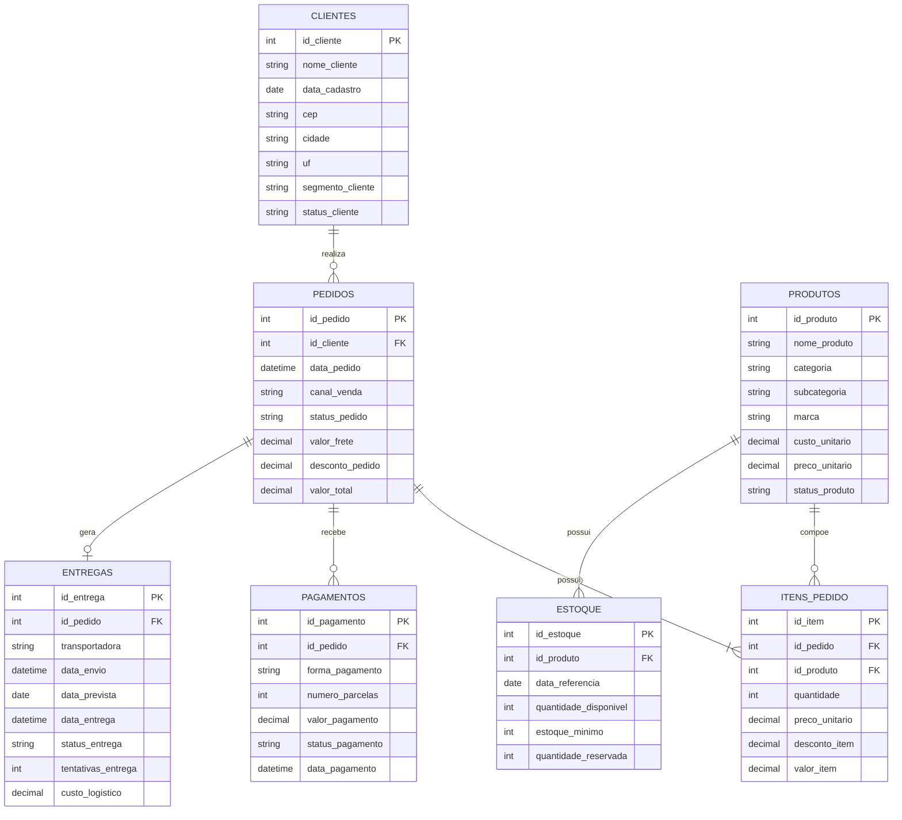

# Modelo Operacional — DataOps Analytics

Este diagrama representa as principais entidades previstas nas fontes de dados operacionais do projeto.

## Observação

Este modelo representa as entidades operacionais planejadas para as fontes de dados.

Ele não representa o modelo dimensional final utilizado no Power BI.

O modelo analítico será desenvolvido posteriormente a partir das transformações realizadas nas camadas Bronze, Silver e Gold.